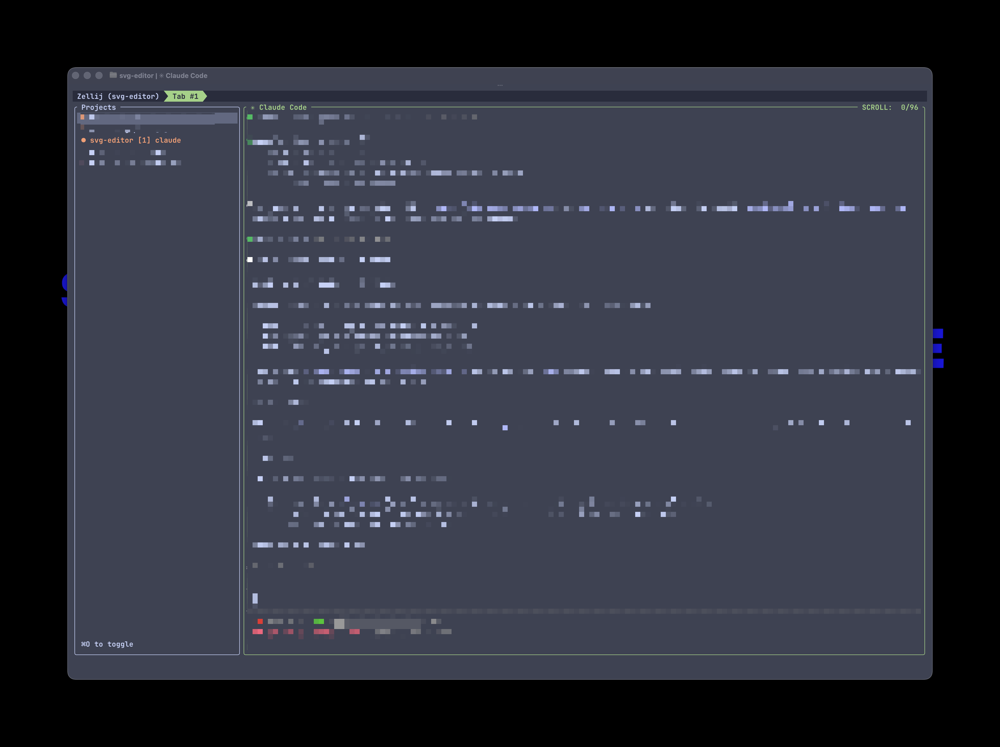

# zellij-project-sidebar

A persistent sidebar plugin for [Zellij](https://zellij.dev) that shows your active project sessions at a glance. Switch between projects with a keypress, start new sessions, and see which ones need your attention.



## Quick start

Give this prompt to Claude Code (or your AI coding tool of choice) and it will handle everything:

> Install the zellij-project-sidebar plugin from https://github.com/AndrewBeniston/zellij-project-sidebar. Clone the repo, build with `cargo build --target wasm32-wasip1 --release`, copy the .wasm to `~/.config/zellij/plugins/`. Then update my Zellij layout to include the sidebar with `scan_dir` pointing to my projects directory. Also set up Claude Code hooks in `~/.claude/settings.json` so the sidebar shows attention indicators when Claude is waiting for input (use the `sidebar::attention::` and `sidebar::clear::` pipe messages documented in the README).

## Why?

Zellij has great session management, but no ambient awareness. You can't see at a glance which projects are running, which session you're in, or which one has Claude Code waiting for input. This plugin gives you a docked sidebar that stays visible across tabs. Think VS Code's sidebar, but for terminal sessions.

## Features

- **Active sessions at a glance**: only shows projects with running or exited sessions, no clutter
- **Current session highlighted**: green text shows you exactly where you are
- **Browse mode**: press `/` to search all discovered projects and start new sessions
- **Attention indicators**: a red diamond appears when a session needs your input (e.g. Claude Code waiting)
- **Session lifecycle**: create, switch to, or kill sessions from the sidebar
- **Auto-discovery**: scans a directory for projects instead of manual configuration
- **New tab with sidebar**: `Cmd+T` creates tabs that include the sidebar
- **Toggle visibility**: `Cmd+O` to focus/unfocus the sidebar
- **Fuzzy search**: subsequence matching in browse mode

## Install

### Build from source

```bash
git clone https://github.com/AndrewBeniston/zellij-project-sidebar.git
cd zellij-project-sidebar
cargo build --target wasm32-wasip1 --release
cp target/wasm32-wasip1/release/zellij-project-sidebar.wasm ~/.config/zellij/plugins/
```

> Requires Rust with the `wasm32-wasip1` target: `rustup target add wasm32-wasip1`

## Configuration

Add the plugin to your Zellij layout (e.g. `~/.config/zellij/layouts/default.kdl`):

### Discovery mode (recommended)

Automatically discovers projects from a directory:

```kdl
layout {
    pane size=1 borderless=true {
        plugin location="tab-bar"
    }
    pane split_direction="vertical" {
        pane size="20%" name="Projects" {
            plugin location="file:~/.config/zellij/plugins/zellij-project-sidebar.wasm" {
                scan_dir "/Users/you/Projects"
                session_layout "/Users/you/.config/zellij/layouts/default.kdl"
            }
        }
        pane
    }
}
```

| Option | Description |
|--------|-------------|
| `scan_dir` | Directory to scan for project folders |
| `session_layout` | Layout file applied when creating new sessions |
| `verbosity` | `"full"` (default) or `"minimal"` to control tab count and command display |

### Legacy mode

Manually list projects:

```kdl
plugin location="file:~/.config/zellij/plugins/zellij-project-sidebar.wasm" {
    project_0 "/Users/you/Projects/my-app"
    project_1 "/Users/you/Projects/api-server"
    project_2 "/Users/you/Projects/docs"
}
```

## Keybindings

### When sidebar is focused

| Key | Action |
|-----|--------|
| `Up` / `Down` | Navigate projects |
| `Enter` | Switch to session (or create if not started) |
| `Delete` | Kill selected session |
| `/` | Enter browse mode (search all projects) |
| `Esc` | Deactivate sidebar |
| `Alt+R` | Rescan project directory |

### Browse mode

| Key | Action |
|-----|--------|
| Type | Fuzzy search projects |
| `Enter` | Open selected project |
| `Backspace` | Delete search character |
| `Esc` | Exit browse mode |

### Global (registered by plugin)

| Key | Action |
|-----|--------|
| `Cmd+O` / `Super+O` | Toggle sidebar focus |
| `Cmd+T` / `Super+T` | New tab with sidebar |

> `Cmd` keys require a terminal that passes them through (e.g. Ghostty with `keybind = cmd+o=unbind`).

## Attention system

The sidebar can show a red `◆` indicator when a session needs your attention. This is powered by Zellij's pipe messaging, so any tool can signal attention.

### Pipe API

```bash
# Flag a session as needing attention
zellij pipe --name "sidebar::attention::session-name"

# Clear attention for a session
zellij pipe --name "sidebar::clear::session-name"
```

Attention is also automatically cleared when you switch to a session via the sidebar.

### Claude Code integration

Add these hooks to `~/.claude/settings.json` to flag attention when Claude is waiting for input:

```json
{
  "hooks": {
    "Notification": [
      {
        "hooks": [
          {
            "type": "command",
            "command": "zellij pipe --name \"sidebar::attention::$ZELLIJ_SESSION_NAME\" 2>/dev/null"
          }
        ]
      }
    ],
    "Stop": [
      {
        "hooks": [
          {
            "type": "command",
            "command": "zellij pipe --name \"sidebar::clear::$ZELLIJ_SESSION_NAME\" 2>/dev/null"
          }
        ]
      }
    ]
  }
}
```

### Other tools

Any process running inside Zellij can signal attention:

```bash
# From a long-running build script
./build.sh && zellij pipe --name "sidebar::attention::$ZELLIJ_SESSION_NAME"

# From a test watcher
zellij pipe --name "sidebar::attention::my-project"
```

## Session status indicators

| Symbol | Colour | Meaning |
|--------|--------|---------|
| `●` | Green | Running session |
| `●` | Yellow | Exited (resurrectable) session |
| `○` | Grey | Not started |
| `◆` | Red | Needs attention |

The current session's entire line is highlighted in green.

## Pairs well with

This plugin handles session-level awareness. For the full picture, it works nicely alongside:

- [**zellij-sessionizer**](https://github.com/lapce/zellij-sessionizer): fuzzy directory search for starting sessions from anywhere on disk, not just your `scan_dir`. Good for one-off projects.
- [**zellij-choose-tree**](https://github.com/lapce/zellij-choose-tree): tree view for jumping between tabs and panes *within* a session. The sidebar handles between-session navigation, choose-tree handles within-session.

## Requirements

- Zellij 0.43.x+
- Rust with `wasm32-wasip1` target

## Licence

MIT
